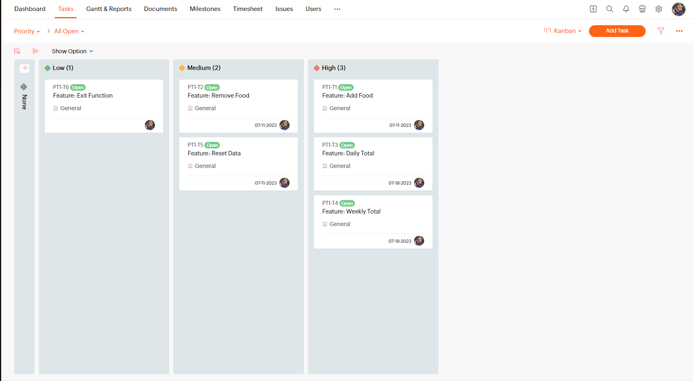
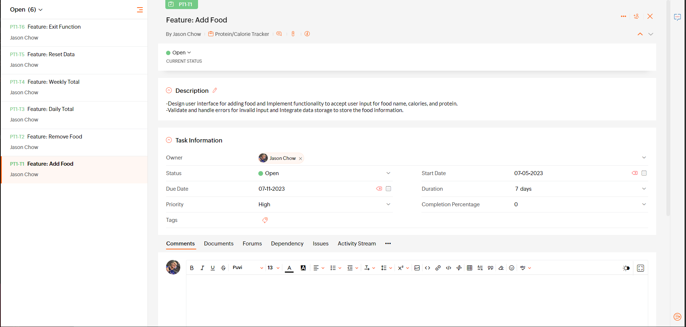
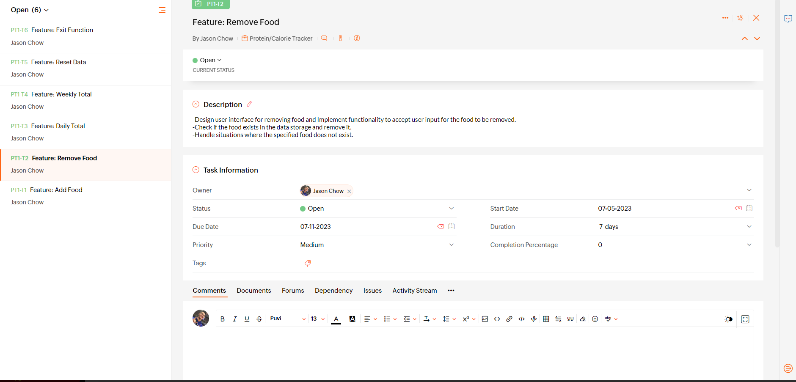
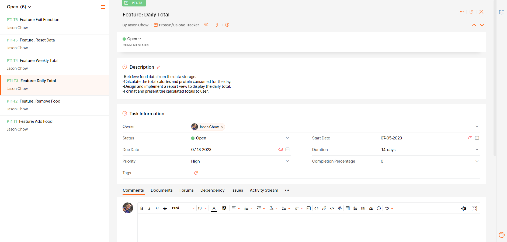
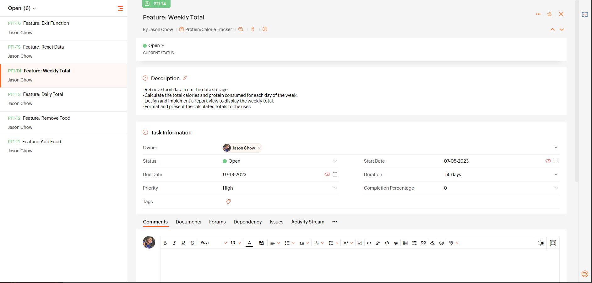
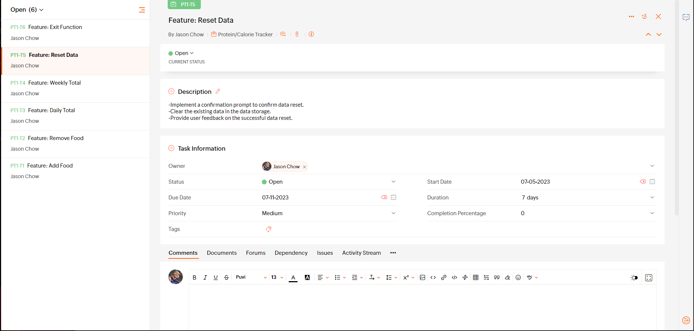
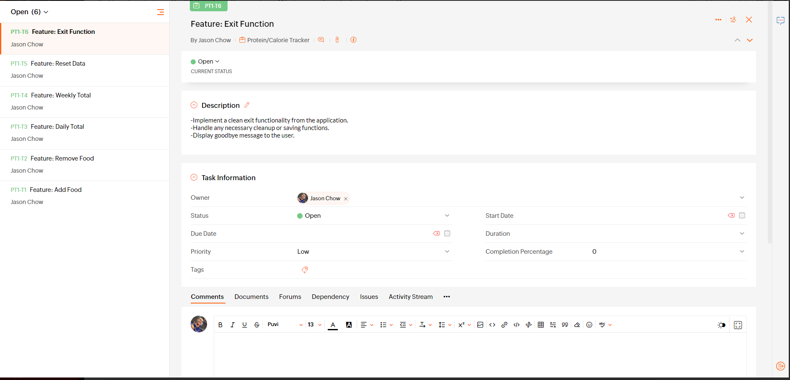

<!-- DOCUMENTATION -->
Python Documentation: https://docs.python.org/
JSON: https://docs.python.org/3/library/json.html
datetime: https://docs.python.org/3/library/datetime.html
os: https://docs.python.org/3/library/os.html
Python Tutorial: https://docs.python.org/3/tutorial/index.html
Python Crash Course: https://nostarch.com/pythoncrashcourse2e
Python Cookbook:https://www.oreilly.com/library/view/python-cookbook/9781449357337/
Stack Overflow: https://stackoverflow.com/

<!-- Link to Github -->
https://github.com/jasonblu123/TerminalApp

Youtube Video link:
https://www.youtube.com/watch?v=B68ysymgmOY

R5 Identify any code style guide or styling conventions that the application will adhere to.

The code is styled with:
Indentation: Using spaces for indentation which helps with easily identifying parent/sibling functions/variables.
Function and Variable Naming: Using the snake case method (words separated by underscores) Functions and variables are named using lowercase letters.
Comments: The code includes comments to explain the purpose and functionality of different sections of code to improve readability and understanding in the code.
Blank Lines: Blank lines are used to separate logical sections of code, improving code readability by sectioning the code.

R6	Develop a list of features that will be included in the application. It must include:
- at least THREE features
- describe each feature

Feature 1: Add Food
This feature allows users to add food items to their protein and calorie tracker. Users can enter the name of the food, along with the corresponding calorie and protein amounts. The information is then stored in the application's data storage, enabling users to keep track of the foods they consume.

Feature 2: Remove Food
With this feature, users can easily remove food items from their protein and calorie tracker. By specifying the name of the food they want to remove, the application checks if it exists in the tracker and deletes it from the data storage if found. This allows users to maintain an accurate record of the foods they are currently consuming.

Feature 3: Daily Total
The daily total feature calculates and presents the total calories and protein consumed by the user on a daily basis. By retrieving the food data from the data storage, the application sums up the calorie and protein values for each food item and provides the aggregated totals to the user. This feature aids users in monitoring their daily intake and progress towards their fitness or dietary goals.

Note: Ensure that your features above allow you to demonstrate your understanding of the following language elements and concepts:
- use of variables and the concept of variable scope
- loops and conditional control structures
- error handling

R7 Develop an implementation plan:
Feature: Add Food
Task Checklist:
-Design user interface for adding food and implement functionality to accept user input for food name, calories, and protein.
-Validate and handle errors for invalid input.
-Integrate data storage to store the food information.
-Test the feature thoroughly.
Priority: High
Deadline: 1 week

Feature: Remove Food
Task Checklist:
-Design the user interface for removing food.
-Implement the functionality to accept user input for the food to be removed.
-Check if the food exists in the data storage and that it updates after removing it.
Handle situations where the specified food does not exist.
Test the feature thoroughly.
Priority: Medium
Deadline: 1 week

Feature: Daily Total
Task Checklist: 
Retrieve food data from the data storage.
Calculate the total calories and protein consumed for the day.
Design and implement report view to display the food items for the day and the daily total calories and protein.
Format and present the calculated totals to user.
Test the feature thoroughly.
Priority: High
Deadline: 2 weeks

Feature: Weekly Total
Task Checklist:
Retrieve food data from the data storage.
Calculate the total calories and protein consumed for each day of the week.
Design and implement report view to display food added and the weekly total for protein and calories.
Format and present the calculated totals to the user.
Test the feature thoroughly.
Priority: High
Deadline: 2 weeks

Feature: Reset Data
Task Checklist:
Implement a confirmation prompt to confirm data reset.
Clear the existing data in the data storage.
Provide user feedback on the successful data reset.
Test the feature thoroughly.
Priority: Medium
Deadline: 1 week

Feature: Exit Function
Task Checklist:
Implement a clean exit functionality from the application.
Handle any necessary cleanup or saving functions.
Display a goodbye message to the user.
Test the feature thoroughly.
Priority: Low
Deadline: 2 days

screenshots:

R8 Design help documentation which includes a set of instructions which accurately describe how to use and install the application.

Protein and Calorie Tracker - User Guide

Installation
Download or clone the application files from the GitHub repository.
Make sure that Python 3 is installed on your computer.

Usage
Open a terminal or command prompt. (ctrl + shift + ~)
Navigate to the directory where the application files are located.
Run the application by executing the following command:

Run python and copy code into the terminal
python tracker.py

The app will display a menu with the following options:
1.Add Food
2.Remove Food
3.Daily Total
4.Weekly Total
5.Reset Data
6.Exit

Choose an option by entering the number and pressing Enter.

Choice 1: Add Food
Enter the food name, calories, and protein amounts when prompted.
The food item will be added to the tracker.

Choice 2: Remove Food
Enter the name of the food item to remove it from the tracker.
If the item exists, it will be removed.

Choice 3: Daily Total
The application will show a report of food items consumed today and the total calories and protein.

Choice 4: Weekly Total
The application will display a report of food items consumed in the current week and the total calories and protein.

Choice 5: Reset Data
Confirm if you want to reset all the stored data.

Choice 6: Exit
The application will be closed.

Follow the on-screen ternimal instructions, provide the required information, and press Enter.